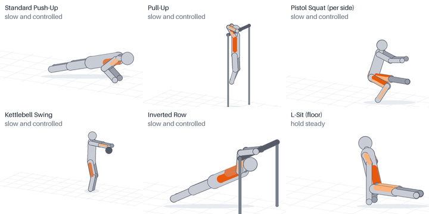

# Calisthenics App

A personal Android app for bodyweight and kettlebell training. You get a circuit planned for the time you have, each exercise demonstrated, and progress tracked across 112 exercises and 25 stretch and warm-up items, up to skills such as the muscle-up, front lever and pistol squat. It runs fully offline: no account, no internet permission, and all data stays on the phone.



I built it as the product owner. AI coding agents wrote most of the code; I set the scope, made the decisions, reviewed the results and tested on my phone. The repository shows the app and also how the work was run: specification, ordered workplan, decision log, approval gates and evidence for every step.

## What the app does

- **Train:** pick a goal (a skill such as the handstand push-up, or a body focus), your equipment profile and the number of rounds. You get a circuit preview with the muscles worked; swap any exercise for today or permanently, then start.
- **During the workout:** big ring timer, looping demo clip, voice cues and a foreground service, so it keeps time with the screen off. Stretches replace passive rest. You log reps while you stretch.
- **Progression:** every exercise has five levels. The app moves you up after three successful sessions spread over a week, holds the level if you fall below target, pauses the whole exercise family if you report pain, and hands you to the next exercise when you master one. Kettlebell levels count per weight: a heavier bell restarts the same exercise, while the same bell leads to harder exercises.
- **Progress:** a skill tree per family (push, pull, squat, core…) with 0–5 stars, locks and equipment badges.
- **History:** a week view and per-workout details, with corrections saved as new revisions so nothing is overwritten.
- **Data:** checksummed backup and restore, crash-safe workout recovery, and a schema-checked database with no destructive migrations.

**Version 2 (release R5, 0.8.0-r5):** a redesigned Train and workout screen, a round preview you can edit (levels, stretches, per-set numbers), three workout formats (circuit, pairs, straight sets), progression rules (levels or rep ranges), saved routines and the ready-made Recommended and Minimalist routines, an optional warm-up, History charts, weight tracks and suggestions for extra equipment. See `STATUS.md` and `docs/evidence/owner-check-r5.md`. Exercise content is still an unreviewed draft and nothing has been tested on a phone yet.

## How the project was run

| Stage | Where |
|---|---|
| Idea and product specification, approved before coding | `docs/00-owner-idea.md`, `docs/01-product-specification.md` |
| Coding specification, workplan (27 tasks) and verification plan | `docs/02`–`04` |
| Decisions, open risks, architecture records | `docs/07-decisions-and-blockers.md`, `docs/adr/` |
| UX overhaul from my phone feedback: 18 findings, 8 open questions, 14 tasks | `docs/10-ux-overhaul-plan.md` |
| Evidence: a verification log per task, phone-run results, reviews | `docs/evidence/` |
| Honest current state | `STATUS.md` |

Ground rules I set for the agents:

- one small task at a time, with tests first;
- the full verification run before every commit, with its log kept;
- no claims without evidence;
- I approve gates myself; an agent never does.

Every number in the exercise catalog is marked DRAFT until I have reviewed it (`docs/review/draft-numbers.md`).

## Engineering

- Kotlin and Jetpack Compose (Material 3), Room, and a foreground service; minimum Android 8.0 (API 26). Built on the open-source [CalisthenicsMemory](https://codeberg.org/Gonbei774/CalisthenicsMemory) app (GPL-3.0), whose old screens were replaced.
- Three modules:
  - `domain`: pure Kotlin, holding the planner, progression engine and session state machine, all deterministic and unit-tested;
  - `data`: storage;
  - `app`: the user interface.
- **308 automated tests** covering domain logic, catalog rules, and Robolectric UI tests at phone size, at text size 1.3 and in dark mode. Lint, an offline build check and a hygiene check run in CI (`.github/workflows/android.yml`).
- The exercise catalog and demo clips are generated from scripts (`tools/gen_starter_catalog.py`, `tools/gen_demo_clips_v3.py`), so content changes are reviewable as code.

## Build

```sh
bash scripts/verify.sh            # tests, lint, debug APK, content validation (JDK 21 + Android SDK 35)
./gradlew :app:assembleDebug      # APK in app/build/outputs/apk/debug/
```

## Status

The app is in personal use on a Galaxy S21. The latest UX overhaul is verified by the automated tests but not yet fully re-tested on the phone. The training numbers are not yet professionally reviewed. Licensed under GPL-3.0 (see `LICENSE`, `THIRD_PARTY_NOTICES.md` and `PRIVACY.md`).
